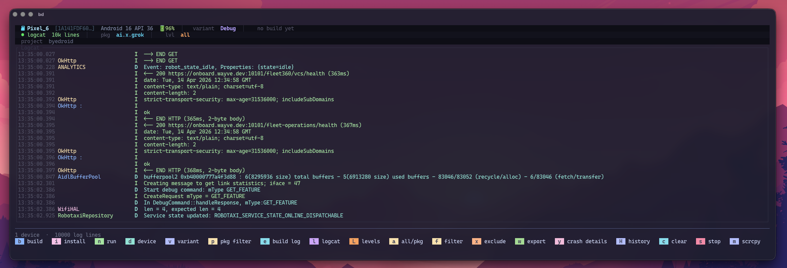

# byedroid



> Bye, Android Studio.

> You don't need Android Studio eating 4 GB of RAM just to read logcat and tap "Run".

In the age of AI agents and terminal-first workflows, your editor is Cursor/Neovim/VS Code and your build system is Gradle on the command line. The only thing keeping Android Studio open was the run button and the log window. **byedroid** replaces both with a single keystroke-driven TUI that starts in under a second.


**Build, install, run, filter logcat, catch crashes** — all without leaving the terminal. Close Android Studio, reclaim your CPU and memory, and let your AI agent drive the code while `byedroid` drives the device.

## Features

- **Device management** — lists connected ADB devices; shows Android version, API level, and battery in the info bar
- **Gradle inference** — detects `applicationId`, `productFlavors`, and `flavorDimensions` from `app/build.gradle(.kts)`; picks the right `assemble<Variant>Debug` / `install<Variant>Debug` task automatically
- **Multi-dimension flavors** — handles `canaryDevDebug`, `stableProdRelease`-style variants across multiple flavor dimensions
- **Build & Install** — spawns Gradle as a subprocess, streams output live; expandable build pane; **build history** overlay (`H`)
- **Run** — install + auto-launch the app with one keystroke (`n`)
- **Variant picker** — floating overlay to switch build variant without editing config files
- **Logcat streaming** — live `adb logcat` with rustycat-style rendering: 23-char tag column, tag repeat suppression, word-wrapped messages
- **Crash / ANR detection** — crash blocks get a red highlight; count in the info bar; `y` opens a **crash detail** popup with the full log and shortcuts to copy, paste-ready agent prompt, export to file, or search online
- **Scrollable log** — scroll back through history with `↑`/`↓` or `j`/`k`, `End` to return to tail
- **Filter + Exclude** — live text filter (`f`) across tag + message; exclude filter (`x`) and config `exclude_filters` to silence noisy tags
- **Level picker** — `L` switches between all logs, errors only, warnings+, info+, debug+, verbose, or config default
- **Export** — `w` writes the current filtered log to `byedroid-<timestamp>.log` in the project root
- **scrcpy** — launch screen mirroring for the selected device (`m`)
- **Per-project config** — `.byedroid.toml` overrides for packages, tasks, log level, scrcpy args, exclude patterns
- **`bd init`** — scaffold `.byedroid.toml` from Gradle inference in one command
- **`bd doctor`** — check `adb`, Java, Gradle wrapper, Android project inference, SDK env, `scrcpy`, and connected devices

## Requirements

| Tool | Required | Notes |
|------|----------|-------|
| Rust 1.74+ | Build only | via [rustup](https://rustup.rs) |
| `adb` | Yes | Android SDK Platform Tools |
| `gradlew`/`gradle` | For build/install | Any standard Android project |
| `scrcpy` | No | For `m` screen mirror action |

## Installation

Binary name: **`bd`**

```bash
# Cargo / crates.io (installs to ~/.cargo/bin)
cargo install byedroid
```

To uninstall the crates.io install: `cargo uninstall byedroid`.

To uninstall source installs: `make uninstall`, `make uninstall-user`, or `make uninstall-system`.

Release tarballs and checksums for Homebrew: `make release`.

## Usage

```bash
# Run from your Android project root
bd

# Point at a project
bd --project /path/to/my/android/app

# Scaffold config without starting the TUI
bd init

# Check local toolchain and project setup
bd doctor
```

`bd` opens immediately. If a device is connected, logcat starts automatically and follows the
project's package(s) by default.

## Keybindings

| Key | Action |
|-----|--------|
| `b` | Build (assemble only) |
| `i` | Install (assemble + install) |
| `n` | **Run** — install then launch the app |
| `v` | Open variant picker |
| `d` | Device picker |
| `p` | Package filter picker |
| `l` | Toggle logcat on/off |
| `L` | Open log level picker |
| `a` | Toggle all-logs / package-filter mode |
| `f` | Open/close **include** filter |
| `x` | Open/close **exclude** filter |
| `w` | Export visible log lines to `byedroid-<timestamp>.log` |
| `y` | Open **crash/ANR details** for the last captured crash, jump the log pane to that crash, then use `c` copy, `a` agent prompt to clipboard, `w` export to `crash-<timestamp>.log`, `s` Google search, `Esc` close. This does not open generic error-level log lines. |
| `H` / `h` | Open/close build history overlay |
| `Space` | Pause / resume log streaming |
| `↑` / `↓` / `j` / `k` | Scroll logcat |
| `PageUp` / `PageDown` | Scroll 20 lines |
| `End` / `G` | Jump to tail (live) |
| `e` | Expand / collapse build output |
| `c` | Clear log buffer |
| `m` | Launch scrcpy |
| `s` | Stop current Gradle / logcat process |
| `r` | Refresh device list |
| `q` | Quit |

In filter / exclude mode: type to edit, `Enter` to confirm, `Esc` to clear.
In the level picker: `↑`/`↓` to move, `Enter` to apply, `Esc` to cancel.
In pickers: `↑`/`↓` to move, `Enter` to select, `Esc` to cancel.
In crash detail: `↑`/`↓` / `j`/`k` scroll the crash text; `PageUp`/`PageDown` page scroll; `c` / `a` / `w` / `s` as above; `Esc` or `q` closes.

## Gradle Inference

`bd` reads `app/build.gradle` (or `.kts`) on startup and infers everything it can:

```groovy
android {
    defaultConfig {
        applicationId "ai.example.app"
    }
    flavorDimensions "track", "environment"
    productFlavors {
        canary { dimension "track" }
        stable { dimension "track" }
        dev {
            dimension "environment"
            applicationIdSuffix ".dev"
        }
        prod { dimension "environment" }
    }
}
```

Result: default variant **`canaryDevDebug`**, tasks **`assembleCanaryDevDebug`** / **`installCanaryDevDebug`**, packages `["ai.example.app", "ai.example.app.dev"]`.

Use the variant picker (`v`) to switch at runtime, or override in `.byedroid.toml`.

## Configuration

| File | Purpose |
|------|---------|
| `~/.config/byedroid/config.toml` | Global: preferred device serial, default log level |
| `.byedroid.toml` | Per-project overrides |
| `.droid-loop.toml` | Legacy per-project overrides still supported |

**`.byedroid.toml` example:**

```toml
# Explicit package list (skips inference)
packages = ["com.example.app", "com.example.app.dev"]

# Override inferred Gradle tasks
assemble_task = "assembleCanaryDevDebug"
install_task  = "installCanaryDevDebug"

# Logcat
log_level   = "D"
log_filters = ["OkHttp", "MyApp"]
exclude_filters = ["chatty", "ViewRootImpl"]

# scrcpy extra flags
scrcpy_args = ["--window-title", "MyApp Mirror"]
```

## Related

Built on top of patterns from:

- [rustycat](https://github.com/cesarferreira/rustycat) — logcat rendering style and parsing
- [dab](https://github.com/cesarferreira/dab) — ADB client helpers

## License

MIT
